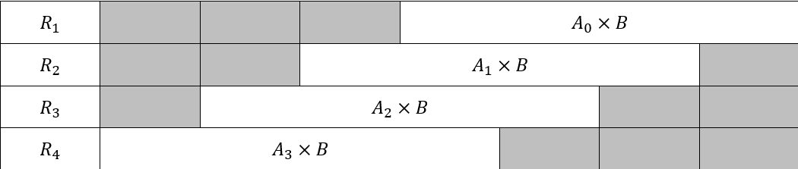
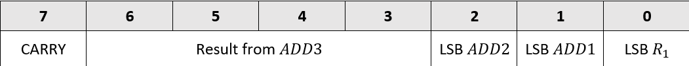

# Multiplication in EEP1

## Background

EEP1 does not have hardware that can perform a multiplication.

Instead it is implemented using software as a combination of SHIFTs and ADDs.

In C++ multiplication is implemented as follows:

```
// implement sum := op1 ∗ op2 (LS 16 bits of) 
// assume int = 16 bits (16−bit version of C)
unsigned int op1, op2, op2_shifted, sum;
sum = 0;
op2_shifted = op2;
while (op1 != 0) {
	if (op1 & 1) {
		sum = sum + op2_shifted;
	}
	op2_shifted = op2_shifted << 1; //left shift by 1
	op1 = op1 >> 1; //right shift by 1
}
```

This works by checking if the LSB of op1 = 1, if it is, add the current op2 to sum. 

It shifts op2 left by 1 (multiplies by 2) and op1 right (move onto the next bit). Repeats this until all of op1 is processed.

Tracing this for op1 = 12 and op2 = 5:

|        | Last op1[0] | op1              | op2_shifted        | sum |
|--------|-------------|------------------|--------------------|-----|
| -      | -           | 0000 1100 (12)   | 0000 0101 (5)      | 0   |
| Loop 1 | 0           | 0000 0110 (6)    | 0000 1010 (10)     | 0   |
| Loop 2 | 0           | 0000 0011 (3)    | 0001 0100 (20)     | 0   |
| Loop 3 | 1           | 0000 0001 (1)    | 0010 1000 (40)     | 20  |
| Loop 4 | 1           | 0000 0000 (0)    | 0101 0000 (80)     | 60  |

## Implementing with EEP1 assembly language

In order to execute this algorithm in C++, it must be converted into assembly language.

We load our inputs (op1 and op2) into R0 and R1. We also set up op2_shifted (R2), by setting it to op2 (R1), and we set up sum (R3) by setting it to 0.

Jump instructions are used to carry out a while loop. Using `CMP` we can compare 2 numbers (without updating register values) and update flags. In this case, we check if R0 (op1) is `x0000`, if it is FlagZ is set to 1. `JEQ` will jump out of the loop if FlagZ from the previous instruction is 1. At the end of the while loop `JMP` carries out an unconditional jump back to the `CMP` instruction, which compares R0 again and decided if the loop should continue.

```
MOV R0, #12 //load 12 into Reg 0 (op1)
MOV R1, #5 //load 5 into Reg 1 (op2)
MOV R2, R1 //Reg 2 holds op2_shifted
MOV R3, #0 //Reg 3 holds sum

CMP R0, #0 //op1 ?= 0 – updates FlagZ (Z=1 if result is 0)
JEQ 8 //Jump out of loop if R0 (op1) is 0
MOV R4, R0
AND R4, #1 //op1 & 1 --> is LSB of R4 1?
JEQ 2 //Skip summing if result is 0
ADD R3, R2 //sum + op2_shifted
LSL R2, R2, #1 //op2_shifted << 1 (shift R2 LEFT by 1 bit : x2)
LSR R0, R0, #1 //op1 >> 1 (shift op1 RIGHT by 1 bit : x0.5)
JMP -8
```

This algorithm should perform 12 x 5 = 60.

## Output

The result of `multiplication_tb.sv` indicates this works. On the final cycle:

```
PASS | cyc 39 | JEQ 8 (yes, END)   | PC=13 R0=0 R1=5 R2=80 R3=60 R4=1
```

The value of R3, which holds `sum` is 60. Since 12x5=60, this is the correct result.

Additionally, all tests passed:

```
PASSED: 40 / FAILED: 0
ALL TESTS PASSED -- R3 = 60 (expect 60 = 12*5)
```

The program ran in 40 cycles. This indicates the while loop ran for 4 iterations. The loop is 9 instructions, and there are 4 set-up instructions.

## Multiplying larger numbers 

This program can only be used with 2 8-bit inputs, to give a 16-bit output. If 2 16-bit inputs (such as the values stored in a register) were used, there would be a 32-bit output. This would be too large to store in a single register.

If larger numbers are used, 2 registers are needed to store a 32-bit output.

1 register is used to store the **upper** 16 bits, 1 register is used to store the **lower** 16 bits.

The `EXT` instruction is used to extend the inputs to R0 and R1 to 16-bits (the input for `MOV` is only 8-bits). *For explanation of how `EXT` works see [extend.sv](../../src/datapath/extend.sv)*.

This code multiplies `x80FF` by `x80FF` (33,023 x 33,023).

```
EXT #128
MOV R0, #255 //op1 = x80FF

EXT #128
MOV R1, #255 //op2 = x80FF

MOV R3, R1 //op2_shifted. LOWER
MOV R4, #0 //op2_shifted. UPPER

MOV R5, #0 //sum. LOWER
MOV R6, #0 //sum. UPPER

CMP R0, #0 //op1 ?= 0 – updates FlagZ (Z=1 if result is 0)
JEQ 11 //Jump out of loop if R0 (op1) is 0
MOV R7, R0
AND R7, #1 //op1 & 1 --> is LSB of R4 1?
JEQ 3 //Skip summing if result is 0
ADD R5, R3 //sum + op2_shifted. LOWER
ADC R6, R4 //sum + op2_shifted + carry. UPPER (carry from lower add)

LSL R4, R4, #1 //shift op2_shifted UPPER left by 1.
LSL R3, R3, #1 //shift op2_shifted LOWER left by 1.
ADC R4, #0 //Add carry from lower shift to upper shift

LSR R0, R0, #1 //shift op1 right by 1

JMP -11
```

The final cycle of this program is:

```
PASS | cyc 187 | JEQ 11         | PC=20 R0=0 R1=33023 R3=0 R4=33023 R5=65025 R6=16639 R7=1
```

The output is structured as `R6:R5`. R6 holds the upper 16-bits and R5 holds the lower 16-bits. 

Therefore our calculated result is 1,090,518,529. Which is the expected result.

```
PASSED: 188 / FAILED: 0
ALL TESTS PASSED -- R6:R5 = 1090518529 (expect 1090518529 = 33023*33023)
```

This program took 188 cycles to run, considerably more than the 8x8 multiplication. This software-based method of multiplication has a time complexity of $O(n^2)$, as the size of the input increases, the computation time increases by a quadratic factor. This is fine for small numbers, but 32x32 or 64x64 bit multiplication would take a long time to compute.

## Expansion: Direct multiplication in hardware

To speed up multiplication, the software approach can be directly implemented in hardware. *For my implementation of the EEP1 this was not done.*

A new instruction would be required, but ALUOPC is 3-bits and 8 instructions are already in use. However, the `MOV` instruction (when used to load a register with the value of another register) has 3 unused bits (`4:2`) which, by default, are `000`. A multiplication instruction can be encoded with the same ALUOPC as `MOV` but bits `4:2` are set to `001`.

*The following explanation describes the process of designing a 4x4 multiplier **in hardware** (to produce an 8-bit output), but the process can be applied to any number of bits.*

Let's split an input, $A$, into 4 bits denoted by $A_0$, $A_1$, $A_2$, $A_3$.

Each of these bits is a control bit for a multiplexer which either outputs $B$ (the other input) or $0$, depending on the control bit. This creates the outputs:

`MUX1` --> $A_0 \times B$

`MUX2` --> $A_1 \times B$

`MUX3` --> $A_2 \times B$

`MUX4` --> $A_3 \times B$

Each bit of $A$ can be either 1 or 0. Therefore the output of each multiplexer is $0 \times B = 0$ or $1 \times B = B$. Each of these is a **partial product** and must be shifted to their position in the input. Eg:

$A_0 \times B$

$A_1 \times B$ --> LEFT by 1

$A_2 \times B$ --> LEFT by 2

$A_3 \times B$ --> LEFT by 3

This creates 4 rows that must be summed together:



This creates the 8-bit output:



This can be implemented directly in hardware for a single-cycle multiplication. This was not done in EEP1, but the datapath can be upgraded so that it can.
